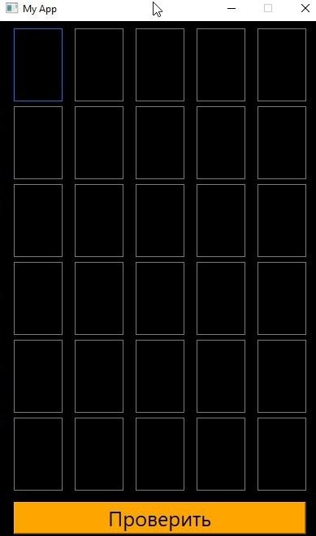

Данный проект заключается в разработке игры "5 слов"
После запуска игры пользователь увидит поле, состоящее из пяти строчек и шести столбцов.
Вводимые слова должны быть существительными в единственнем числе.

Последовательность игры:
1. Ввести слово, например «океан»
2. Нажать кнопку Проверить или Enter
3. Изменение цвета клеток

Расшифровка цветов:
1. Желтый - правильное местоположение буквы
2. Белый — буква в слове есть, но неправильное местоположение
3. Серый — буквы в слове нет

